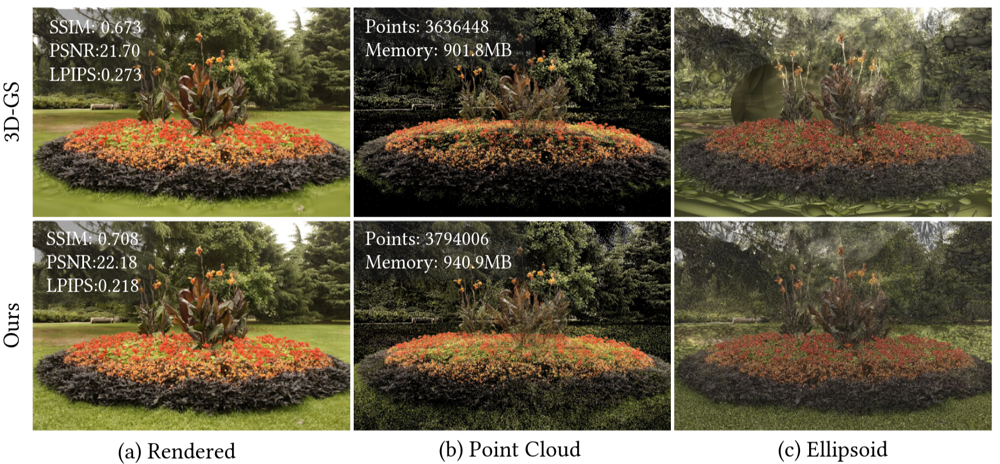
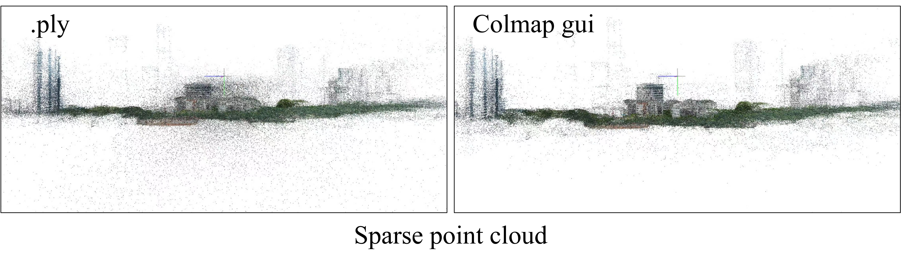
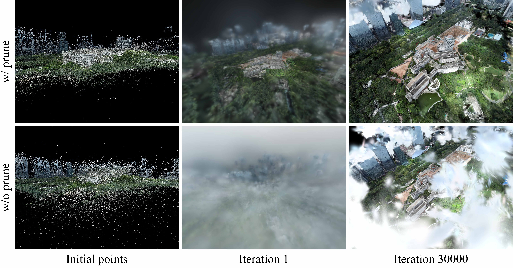

- <p align="center">

    <h1 align="center">AbsGS: Recovering Fine Details for 3D Gaussian Splatting</h1>
    <p align="center">
        <a href="https://github.com/TY424">Zongxin Ye</a><sup>+</sup>
      ·
      <a href="https://github.com/leo-frank">Wenyu Li</a><sup>+</sup>
      ·
      <a href="https://github.com/Liu-SD">Sidun Liu</a>
      ·
      <a href="https://github.com/qiaopTDUN">Peng Qiao</a>
      ·
      <a >Yong Dou</a>
    </p>
    <h3 align="center"> <a href="https://arxiv.org/pdf/2404.10484.pdf">arXiv</a> | <a href="https://ty424.github.io/AbsGS.github.io/">Project Page</a> | <a href="https://github.com/TY424/AbsGS">Code(Coming soon)</a> </h3>
    <div align="center"></div>
  </p>


  <p align="center">
    <a href="">
      
    </a>
  </p>


  <p align="left">
  We reveal that the original adaptive density control strategy in 3D Gaussian Splatting (3D-GS) has the flaw of gradient collision which results in degradation, and propose homodirectional gradient as the guidance for densification. (a) Our method recovers fine details and achieves higher quality novel view synthesis results. SSIM, PSNR, LPIPS are inset. (b) Our proposed method yields more reasonable distribution of Gaussion points with comparable number of Gaussians and memory consumption with 3D-GS. (c) By adopting our method, the large Gaussians in over-reconstructed regions that lead to blur are eliminated.</p>

  <br>

​    

## Installation

The repository contains submodules, thus please check it out with 

```shell
git clone git@github.com:TY424/AbsGS.git --recursive

# if you have an environment used for 3dgs, use it
# if not, create a new environment
conda env create --file environment.yml
conda activate Absgs

cd submodules/
python ./diff-gaussian-rasterization/setup.py install
python ./simple-knn/setup.py install
```


## Training and Evaluation

```
# Train
python train.py 
-s <path to COLMAP or NeRF Synthetic dataset>
-m <output path>
--eval # Train with train/test split

# Generate renderings
python render.py -s <path to COLMAP or NeRF Synthetic dataset> -m <output path>

# Compute error metrics on renderings
python metrics.py -m <path to trained model> 

# This script specifies the routine used in our evaluation
python full_eval.py -m360 <mipnerf360 folder> -tat <tanks and temples folder> -db <deep blending folder>
```


## Some minor changes

Based on AbsGS, we have made some minor modifications to improve performance in large scenarios. None of these modifications were utilized in our paper.

### Initial pruning

We noticed that the visualization results of point clouds in COLMAP are inconsistent with those in the `.ply`  file, as COLMAP filters them based on reprojection errors and track length during visualization. Therefore, we modified the  `read_points3D_binary`  function. In addition, pruning is performed initially based on the size of the radius to remove noise. 



### Weight-based pruning

Taking inspiration from the pruning strategy based on  ```max_radii2d```  in  3DGS, we conduct pruning based on the contribution (```max_weight```) of the Gaussian  during rendering , where ```max_weight``` represents the maximum weight of the Gaussian  participated in all rendering processes.

In fact, the pruning strategy based on max_radii2d does not work for 3DGS, and we haven't fixed this bug.



>Sci-Art scene from UrbanScene3D dataset
>
>w/ prune:   uses Initial pruning and weight-based pruning


 ## New Arguments

  #### --percent_dense

  Percentage of scene extent (0--1) a point must exceed to be splite, ```0.001``` by default.

  #### --densify_grad_threshold

  Limit that decides if points should be cloned based on 2D position gradient, ```0.0002``` by default.

  #### --densify_grad_abs_threshold

  Limit that decides if points should be splite based on homodirectional gradient, ```0.0004``` by default.

  #### --use_reduce

  Whether to periodically reduce opacity, ```True``` by default. 

  #### --opacity_reduce_interval

  How frequently to reduce opacity, ```3_000``` by default. 

  #### --use_prune_weight

  Whether to prune based on weights, ```False``` by default. 

  #### --min_weight

  Gaussians with weights less than this threshold will be pruned, ```0.5``` by default. 

  #### --prune_until_iter

  Iteration where pruning by weight stops, ```15_000``` by default.


  # Citation

  If you find our code or paper useful, please consider citing:

  ```bibtex
  @misc{ye2024absgs,
        title={AbsGS: Recovering Fine Details for 3D Gaussian Splatting}, 
        author={Zongxin Ye and Wenyu Li and Sidun Liu and Peng Qiao and Yong Dou},
        year={2024},
        eprint={2404.10484},
        archivePrefix={arXiv},
        primaryClass={cs.CV}
  }
  
  @Article{kerbl3Dgaussians,
        author       = {Kerbl, Bernhard and Kopanas, Georgios and Leimk{\"u}hler, Thomas and Drettakis, George},
        title        = {3D Gaussian Splatting for Real-Time Radiance Field Rendering},
        journal      = {ACM Transactions on Graphics},
        number       = {4},
        volume       = {42},
        month        = {July},
        year         = {2023},
        url          = {https://repo-sam.inria.fr/fungraph/3d-gaussian-splatting/}
  }
  ```

  
